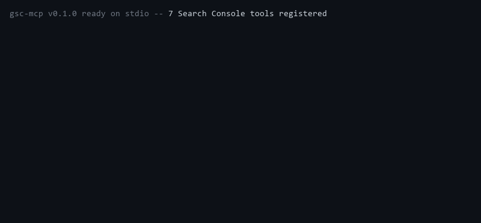

<div align="center">

# gsc-mcp

Google Search Console for AI agents: search performance, striking-distance keywords, sitemaps, and URL inspection. SEO automation you can hand to an assistant.

[](LICENSE)
[](https://www.npmjs.com/package/@conorbronsdon/gsc-mcp)
[](https://nodejs.org/)
[](https://chainofthought.show)
[](https://x.com/ConorBronsdon)



</div>

---

An MCP server for [Google Search Console](https://search.google.com/search-console). It gives an AI assistant the data and the levers behind organic search: how queries and pages perform, which keywords are one nudge away from page one, the state of your sitemaps, and whether a specific URL is indexed — plus the ability to submit or remove sitemaps.

**Why this exists.** Search Console is where SEO actually happens, but its UI is click-heavy and its data is hard to act on at a glance. The single most useful view — queries ranking in *striking distance* of page one — is not even a built-in report; you have to filter and eyeball it. This server puts that view, and the rest of the funnel, in front of an agent so the boring parts of SEO (find the near-miss keywords, check index status, keep sitemaps healthy) can be automated.

It was built to run SEO for two sites — a podcast and a personal site — but nothing here is specific to them. Point it at any property you have verified.

## Tools

| Tool | Access | What it returns | API |
|------|--------|-----------------|-----|
| `gsc_list_sites` | read | Verified properties + permission level | `GET webmasters/v3/sites` |
| `gsc_search_analytics` | read | Clicks/impressions/CTR/position by query, page, country, device, or date | `POST .../searchAnalytics/query` |
| `gsc_striking_distance` | read | Queries at avg position 8–25 with enough impressions — the optimization list | computed from search analytics |
| `gsc_list_sitemaps` | read | Submitted sitemaps with status, last download, warning/error counts | `GET .../sitemaps` |
| `gsc_submit_sitemap` | **write** | Submits/pings a sitemap to Google | `PUT .../sitemaps/{feedpath}` |
| `gsc_delete_sitemap` | **write, destructive** | Deregisters a sitemap from Search Console | `DELETE .../sitemaps/{feedpath}` |
| `gsc_inspect_url` | read | Index status, last crawl, canonical, mobile/rich-results verdicts | `POST searchconsole/v1/urlInspection/index:inspect` |

Every tool carries MCP read/write annotations, so a client can tell the two write tools apart from the five read-only ones before calling them. Read tools are `readOnlyHint: true`; `gsc_submit_sitemap` is a non-destructive write; `gsc_delete_sitemap` is `destructiveHint: true`.

List tools default `row_limit` / `limit` low (25) to keep responses small — agents pay tokens per response.

## Authentication

This server uses an OAuth **installed-app** credential (a saved refresh token), not a service account or an API key. It reads the credential from:

```
~/.config/gws/searchconsole_credentials.json
```

That is the exact file produced by the `seo-auth-setup.py` helper used elsewhere in this author's tooling, so **one OAuth mint serves both** the Python SEO scripts and this MCP server. The file is google-auth's `Credentials.to_json()` shape: it contains `client_id`, `client_secret`, `refresh_token`, and `scopes`. The server refreshes short-lived access tokens against Google's token endpoint directly with `fetch` — no heavy `googleapis` dependency.

To create the file yourself if you do not already have it:

1. In Google Cloud Console, create an **OAuth client** of type *Desktop app* and download its `client_secret.json`.
2. Enable the **Search Console API** on that project.
3. Run an installed-app OAuth flow requesting the scope you need (see below) and save the resulting credentials to `~/.config/gws/searchconsole_credentials.json`. Any standard OAuth-installed-app snippet works; the bundled `seo-auth-setup.py` does exactly this in one command.

### Scopes: read-only vs. full

- **Read tools** work with `https://www.googleapis.com/auth/webmasters.readonly`.
- **Write tools** (`gsc_submit_sitemap`, `gsc_delete_sitemap`) and **URL inspection** need the full `https://www.googleapis.com/auth/webmasters` scope.

If your saved credential only has the read-only scope, the read tools work and the write tools return a clear "re-mint with the full scope" error rather than a cryptic 403. Re-running the mint with the full scope upgrades the same file in place; read tools keep working throughout.

Set `GSC_CREDENTIALS_PATH` to point at a different credential file if you do not use the default location.

### Starts without a credential

The server boots and answers `tools/list` even when no credential is present, so MCP inspectors can introspect it. Tool *calls* then return a setup pointer (to stderr at startup, and as the tool result). stdout is reserved for the MCP transport and stays clean.

## Setup

### 1. Verify your property in Search Console

Add your site at [search.google.com/search-console](https://search.google.com/search-console). A **Domain property** (verified with a DNS TXT record) covers http/https and all subdomains and is the recommended choice. Note the exact property string — `gsc_list_sites` will show it as `sc-domain:example.com` (Domain) or `https://example.com/` (URL-prefix).

### 2. Mint the credential

Create `~/.config/gws/searchconsole_credentials.json` as described under **Authentication**, requesting the full `webmasters` scope if you want the write and URL-inspection tools.

### 3. Configure your MCP client

#### Claude Code

Add to your `.mcp.json`:

```json
{
  "mcpServers": {
    "gsc": {
      "command": "npx",
      "args": ["-y", "@conorbronsdon/gsc-mcp"]
    }
  }
}
```

#### Claude Desktop

Add to your `claude_desktop_config.json`:

```json
{
  "mcpServers": {
    "gsc": {
      "command": "npx",
      "args": ["-y", "@conorbronsdon/gsc-mcp"]
    }
  }
}
```

No `env` block is needed when the credential is at the default path. Set `GSC_CREDENTIALS_PATH` if it lives elsewhere.

### 4. Verify

Ask your assistant: "List my Search Console properties," then "Show me striking-distance keywords for it over the last 28 days."

## Limitations

Read these so you know what the numbers mean and what this can and cannot do.

- **No request-indexing tool — by design.** Search Console's "Request indexing" button has **no public API**. Google's Indexing API only supports `JobPosting` and `BroadcastEvent` pages, not normal content, and using it for normal pages violates its terms. So there is deliberately no "ask Google to index this page" tool here; for normal pages, requesting indexing is a manual click in the Search Console UI. `gsc_submit_sitemap` is the supported, API-backed way to nudge crawling.
- **Data lags ~2–3 days.** Search Analytics is not real-time. End your date ranges a few days before today or the last days come back empty.
- **`searchAnalytics` is capped per call.** `row_limit` caps at 1000 here (the API allows 25,000 with pagination); for very large pulls, page with `start_date`/dimension filters rather than asking for everything at once.
- **Striking distance is computed client-side.** It pulls up to 1000 query rows and filters to the position band. On a site with thousands of ranking queries, the band view reflects the top 1000 by clicks, not the entire long tail.
- **URL inspection is rate-limited and slow.** Google enforces a low daily quota on the URL Inspection API and each call can take a second or two. Inspect specific URLs you care about; do not loop it over a whole sitemap.
- **No property add/remove tools.** Verifying a property is a stateful, error-prone flow (DNS TXT, meta tag, file upload) that does not fit a single tool call. Add and verify properties in the Search Console UI; this server operates on properties you have already verified.
- **General API quotas apply.** The server surfaces a clear error on HTTP 429. Keep `row_limit` and inspection volume modest.

## Development

```bash
git clone https://github.com/conorbronsdon/gsc-mcp.git
cd gsc-mcp
npm install
npm run build
npm test
```

Run locally:

```bash
npm start
```

Tests mock `fetch` and make no network calls.

## Contributing

Issues and pull requests are welcome. If a Search Console endpoint is worth wrapping as a tool, open an issue describing what it should return and the endpoint it maps to. Keep the contract honest: read tools stay read-only, write tools carry the right annotations, and responses stay compact.

## About

Built and maintained by [Conor Bronsdon](https://github.com/conorbronsdon). I host the [Chain of Thought](https://chainofthought.show) podcast, which covers AI infrastructure, developer tools, and how practitioners actually use this stuff. I built this to pull SEO work into the agent workflows that run the show and my site.

Companion tools:

- [op3-mcp](https://github.com/conorbronsdon/op3-mcp): podcast analytics through OP3 — downloads, geography, apps, per-episode breakdowns.
- [podcast-benchmark](https://github.com/conorbronsdon/podcast-benchmark): benchmark your show against peers on public signals.
- [Transistor-MCP](https://github.com/conorbronsdon/Transistor-MCP): the Transistor.fm MCP server — episodes, transcripts, download counts.
- [substack-mcp](https://github.com/conorbronsdon/substack-mcp): read posts and manage drafts on Substack, safe for agent workflows.
- [ai-tools-for-creators](https://github.com/conorbronsdon/ai-tools-for-creators): a curated list of AI skills and MCP servers for people who ship ideas for a living.

More at [chainofthought.show](https://chainofthought.show) and on [X](https://x.com/ConorBronsdon).

---

## Disclaimer

*All views, opinions, and statements expressed on this account are solely my own and are made in my personal capacity. They do not reflect, and should not be construed as reflecting, the views, positions, or policies of Modular. This account is not affiliated with, authorized by, or endorsed by Modular in any way.*

## License

MIT
